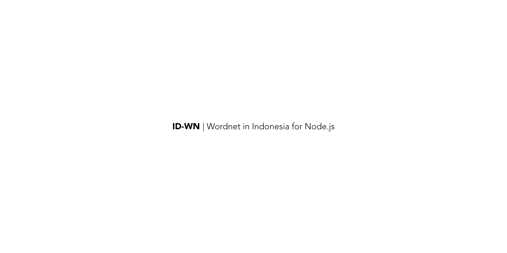

En-Wordnet is a node.js module which makes [Wordnet Bahasa](http://wn-msa.sourceforge.net/index.eng.html) available as a package.

## About

Princeton University defines it as 

> WordNet® is a large lexical database of English. Nouns, verbs, adjectives and adverbs are grouped into sets of cognitive synonyms (synsets), each expressing a distinct concept. Synsets are interlinked by means of conceptual-semantic and lexical relations. The resulting network of meaningfully related words and concepts can be navigated with the browser. WordNet is also freely and publicly available for download. WordNet's structure makes it a useful tool for computational linguistics and natural language processing.

Inspired by [Princeton WordNet](https://wordnet.princeton.edu/) and the [Global WordNet Grid](http://globalwordnet.org/), the team at Wordnet Bahasa decided to create a large, freely available, semantic dictionary of the Malay languages (Malaysian and Indonesian)

## Where did you find this?

The latest version of the Bahasa Wordnet can be found at their [website](https://sourceforge.net/projects/wn-msa/) which is hosted on SourceForge. You can find more information about the project [here](http://wn-msa.sourceforge.net/index.eng.html).

## Is this credible?

In their own works, the creators of Bahasa Wordnet say this:

> Disclaimer: We estimate that this release contains errors in as many as 5–10% of entries. We decided to initially spend more effort in increasing the cover than in checking each entry. As we translate the glosses and sense tag text, we expect to fix many of the errors. We also welcome [feedback](wn-msa-devel@lists.sourceforge.net).

This means that not everything can be used, but the ones which can be are very clearly identified. The documentation shares this

> Y = hand checked and good
> O = automatic high quality (good)
> All others can be ignored, if you're looking for quality output only

If you would like to try it out for yourself, please [go here](http://compling.hss.ntu.edu.sg/omw/cgi-bin/wn-gridx.cgi?usrname=&gridmode=wnbahasa).

## Are there things that are missing

Not that I know of. Please raise an issue if you find something is incorrect.

## How do I actually use this data?

The Parser for wordnet DB files will be in a separate repository. This is because in order to use this package, we will also need the [english package](https://github.com/open-language/en-wordnet).

## How to I understand the data structures

The file format used is `synset\tlang\tgoodness\tlemma`. synset is the offset-pos from Princeton wordnet 3.0.
- Language:
    - B (Bahasa = msa); 
    - I (Indonesian = ind); 
    - M (Malay = zsm)
- Goodness (or Quality)
    - Y = hand checked and good
    - O = automatic high quality (good)
    - M = automatic medium quality (ok) - should be ignored
    - L = automatic, probably bad (low) - should be ignored
    - X = hand checked and bad - should be ignored

The data structure for the Princeton project for english defined in these two documents
- [wndb](https://wordnet.princeton.edu/documentation/wndb5wn), which talks about index.* and data.* files
- [wninput](https://wordnet.princeton.edu/documentation/wninput5wn), which talks about the lexicographer file format and the word syntax

## This is released under which license?

This is shared under the [MIT license](https://sourceforge.net/p/wn-msa/tab/HEAD/tree/trunk/LICENSE).

## Credits

- [TJ Holowaychuk](https://github.com/tj) for showing us how to use black and white beautifully to create the image on the top of the readme. Inspiration from [apex/up](https://github.com/apex/up)
- [Bahasa Wordnet Team](http://wn-msa.sourceforge.net/index.eng.html) for bringing so much sanity in the world